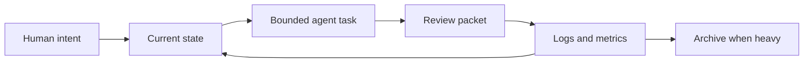

# Alexandria

**A markdown-first continuity system for AI-assisted work.**

Alexandria is a proof-of-concept for one problem: AI work loses continuity too easily.

Projects drift. Chat history gets buried. Agents forget why choices were made. A new model or a tired human can enter the work and waste the first hour reconstructing what should already be clear.

Alexandria tests a different pattern:

- keep the vault human-readable
- make current state explicit
- make agent handoffs visible
- track evidence, not vibes
- separate public structure from private work
- preserve the reasoning thread when work is interrupted

It is not a product, app, database, or automation framework. It is a documented operating pattern for keeping human and AI work recoverable over time.

## What This Repo Shows

This repository is the public-safe package. It is not a raw export of the private vault.

It shows:

- the continuity model behind Alexandria
- the agent relay loop used for Claude and Codex style collaboration
- the problem-card tracking protocol for difficult tasks
- the audit and stress-test approach used to reduce drift
- the public/private boundary that prevents sensitive work from leaking into public docs
- copyable templates for adapting the pattern

## Current Proof Snapshot

Internal validation snapshot, June 2026:

| Area | Result |
|---|---:|
| Active broken wikilinks | 0 |
| Files missing required note headers | 0 |
| Stale thinking notes older than 60 days | 0 |
| Empty markdown folders | 0 |
| Agent relay loop | Active |
| Problem-solving tracker | Active |
| Public/private boundary | Active |

See [`reports/ALEXANDRIA_VALIDATION_SUMMARY.md`](reports/ALEXANDRIA_VALIDATION_SUMMARY.md).

## Start Here

| If you want to understand... | Read |
|---|---|
| What Alexandria is | [`docs/01_CONTINUITY_SYSTEM.md`](docs/01_CONTINUITY_SYSTEM.md) |
| Why it is structured this way | [`docs/02_CORE_PRINCIPLES.md`](docs/02_CORE_PRINCIPLES.md) |
| How multiple agents coordinate | [`docs/03_AGENT_RELAY_LOOP.md`](docs/03_AGENT_RELAY_LOOP.md) |
| How difficult tasks stay recoverable | [`docs/04_PROBLEM_SOLVING_TRACKING.md`](docs/04_PROBLEM_SOLVING_TRACKING.md) |
| How the system is tested | [`docs/05_STRESS_TESTING_AND_AUDITS.md`](docs/05_STRESS_TESTING_AND_AUDITS.md) |
| How public and private material are separated | [`docs/06_PUBLIC_PRIVATE_BOUNDARY.md`](docs/06_PUBLIC_PRIVATE_BOUNDARY.md) |
| Why the project exists | [`docs/00_FOUNDING_CONTEXT.md`](docs/00_FOUNDING_CONTEXT.md) |

## Templates

| Template | Use |
|---|---|
| [`templates/TASK_PACKET_TEMPLATE.md`](templates/TASK_PACKET_TEMPLATE.md) | Give an agent a bounded task |
| [`templates/PROBLEM_CARD_TEMPLATE.md`](templates/PROBLEM_CARD_TEMPLATE.md) | Track a hard problem without losing the thread |
| [`templates/SESSION_OPEN_CLOSE_TEMPLATE.md`](templates/SESSION_OPEN_CLOSE_TEMPLATE.md) | Preserve state across sessions |

## Design Position

Alexandria deliberately avoids becoming a hidden automation system.

The durable part is not a specific model, plugin, CLI, or platform. The durable part is the operating contract:

1. Read the current state before acting.
2. Work inside an explicit scope.
3. State uncertainty instead of guessing.
4. Log what changed.
5. Preserve the next handoff.
6. Archive old weight before it breaks retrieval.

## Status

This is an active proof-of-concept. The public repository is intentionally smaller than the private working vault.

Public docs answer how the system works. Private files contain live state, logs, raw work, screenshots, credentials-adjacent details, and personal operating context. Those are excluded by design.

## Use and Safety

This repository is shared for learning and adaptation. Review [`SECURITY.md`](SECURITY.md) before copying the structure into a public, client-facing, or team workspace.
