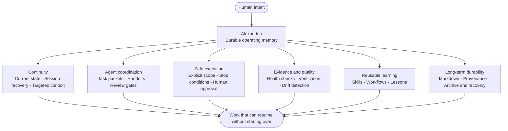
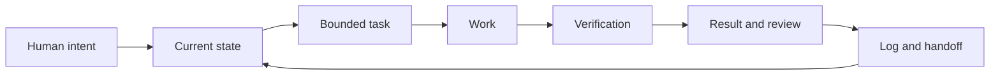
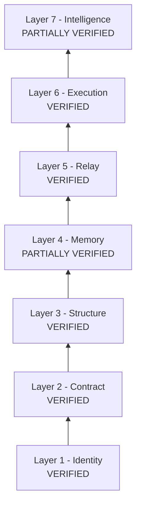

# Alexandria

**A durable operating memory for humans and AI agents.**

Alexandria is a markdown-first system for preserving context, coordinating work, and recovering cleanly across sessions, agents, model changes, and long gaps.

It was built from the ground up through repeated real use. Rules were added when failures or recurring friction justified them, important claims were tested, and uncertain layers stayed partially verified instead of being promoted for appearance's sake.

The result is not an autonomous agent framework or a black-box productivity app. It is a portable, human-readable operating layer that helps people and AI continue serious work without starting over.

## What Alexandria Offers

| Capability | What it provides |
|---|---|
| **Session recovery** | Restores the current mission, recent trajectory, warnings, and next action from a small set of canonical state files. |
| **Cross-agent handoffs** | Gives different agents explicit task, inbox, outbox, ownership, review, and closeout rules. |
| **Durable memory** | Keeps working state and history in ordinary Markdown instead of hidden chat memory or a proprietary database. |
| **Targeted retrieval** | Loads the smallest useful context for a task rather than treating the entire vault as one prompt. |
| **Evidence-based workflows** | Turns repeated work into visible procedures with inputs, outputs, approval points, verification, and stop conditions. |
| **Safety boundaries** | Separates private, public, active, and archival material and keeps consequential actions human-approved. |
| **Health and drift checks** | Uses deterministic checks to catch broken navigation, missing structure, stale dispatches, and contradictory state. |
| **Recovery and provenance** | Preserves append-only history, dated reports, backups, and the reasoning behind important decisions. |

## How Work Moves Through Alexandria

The loop is deliberately simple: read what is true, work inside a visible boundary, verify the result, and leave the next session a reliable place to resume.

## What Has Been Proven

Alexandria completed a five-week verification project in July 2026. Layers were promoted only when the recorded evidence supported them.

| Layer | Result in plain language |
|---|---|
| Identity | Agent roles and system values influence real operating decisions. |
| Contract | Ownership, authority, safety, and reporting rules are operationally consistent. |
| Structure | The active working system is navigable and structurally coherent. |
| Memory | Recovery works, with documented residual limits rather than a claim of perfection. |
| Relay | Work can move between agents through explicit dispatch, review, and closeout states. |
| Execution | The documented workflow has survived walkthroughs and real task runs. |
| Intelligence | Lessons are recorded and reused, but more independent fault-detection evidence is required. |

Two layers remained partial when the evidence was not strong enough. That refusal to overclaim is part of the design, not a missing marketing polish.

See the public-safe [`Alexandria Validation Summary`](reports/ALEXANDRIA_VALIDATION_SUMMARY.md) for the proof boundary and remaining caveats.

## Why It Is Thoughtful

Most continuity systems begin with automation. Alexandria began with the failure modes:

- sessions that forget what happened;
- agents that overwrite one another's state;
- confident summaries that hide uncertainty;
- private material drifting toward public surfaces;
- procedures that exist only in one tool or one person's memory;
- maintenance systems that become more work than the work itself.

Alexandria answers those problems with durable choices:

- **Markdown is the source of truth.** The system remains readable without a particular AI model, application, or database.
- **State and history are different.** Current context stays concise while append-only records preserve provenance.
- **Agents are replaceable; memory is not.** Roles and contracts matter more than vendor names.
- **Human judgment stays visible.** Publishing, deletion, credentials, services, and major structural changes remain approval-gated.
- **Small proven changes beat speculative architecture.** New machinery must earn its place through real friction.
- **Imperfect use is expected.** Recovery paths, checks, and explicit ownership are designed for interruptions and human inconsistency.

## What This Public Repository Contains

This repository is a derived, public-safe explanation of Alexandria. It is not a raw export of the private working vault.

| If you want to understand... | Read |
|---|---|
| Why Alexandria exists | [`docs/00_FOUNDING_CONTEXT.md`](docs/00_FOUNDING_CONTEXT.md) |
| The continuity model | [`docs/01_CONTINUITY_SYSTEM.md`](docs/01_CONTINUITY_SYSTEM.md) |
| The design principles | [`docs/02_CORE_PRINCIPLES.md`](docs/02_CORE_PRINCIPLES.md) |
| How multiple agents coordinate | [`docs/03_AGENT_RELAY_LOOP.md`](docs/03_AGENT_RELAY_LOOP.md) |
| How difficult tasks stay recoverable | [`docs/04_PROBLEM_SOLVING_TRACKING.md`](docs/04_PROBLEM_SOLVING_TRACKING.md) |
| How system claims are tested | [`docs/05_STRESS_TESTING_AND_AUDITS.md`](docs/05_STRESS_TESTING_AND_AUDITS.md) |
| How private and public material are separated | [`docs/06_PUBLIC_PRIVATE_BOUNDARY.md`](docs/06_PUBLIC_PRIVATE_BOUNDARY.md) |

### Reusable templates

| Template | Use |
|---|---|
| [`templates/TASK_PACKET_TEMPLATE.md`](templates/TASK_PACKET_TEMPLATE.md) | Give an agent a bounded, reviewable task. |
| [`templates/PROBLEM_CARD_TEMPLATE.md`](templates/PROBLEM_CARD_TEMPLATE.md) | Track a difficult problem without losing its reasoning thread. |
| [`templates/SESSION_OPEN_CLOSE_TEMPLATE.md`](templates/SESSION_OPEN_CLOSE_TEMPLATE.md) | Preserve state and the next action across sessions. |

## What Alexandria Is Not

Alexandria is not:

- an autonomous multi-agent runtime;
- a replacement for human judgment;
- a promise that every memory is perfectly current;
- a raw private vault intended for public upload;
- dependent on vector databases, hosted services, or hidden automation.

It can be operated manually. Automation can assist it, but the important knowledge remains visible in files people can inspect, understand, and repair.

## Who It Is For

Alexandria is for people doing serious, continuing work with AI: research, writing, operations, learning, or multi-session projects where context loss is expensive.

If you are tired of rebuilding the same explanation every session, Alexandria offers a different foundation: visible memory, honest state, deliberate handoffs, and a system designed to recover.

## Use and Safety

Review [`SECURITY.md`](SECURITY.md) before adapting the system for a public, client-facing, or team workspace.

---

Built through documented trial, failure, repair, and verification. Human-readable by design.
