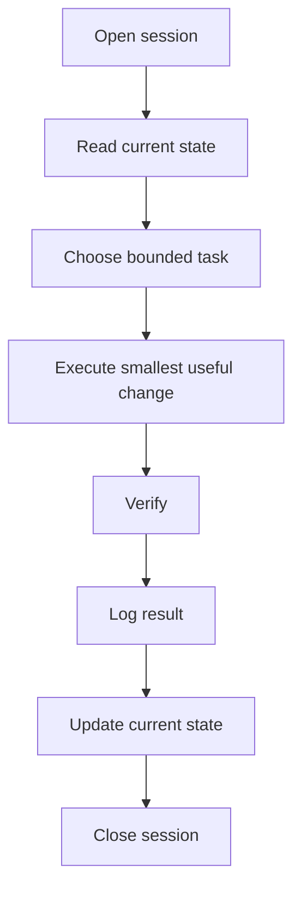

# Continuity System

Alexandria exists to preserve understanding across time.

Most AI workflows fail quietly at the same point: the work continues, but the context does not. A human returns after a gap, a new agent enters the project, or a session resets, and the system no longer knows what matters now.

Alexandria treats continuity as the core problem, not an accessory.

## Core Question

What must remain connected so understanding is not lost?

That question drives the structure:

- current state is separated from history
- decisions have a durable home
- handoffs are written, not assumed
- logs are append-only
- old weight moves to archive instead of staying in the active layer
- agents read the smallest useful context before acting

## What Alexandria Is

Alexandria is a markdown-first operating pattern for human and AI collaboration.

It is built from ordinary files:

- state notes
- logs
- handoff packets
- templates
- audit reports
- security boundaries
- archive rules

Any human can read it without special tooling. Any capable AI agent can operate from it by reading the relevant markdown.

## What Alexandria Is Not

Alexandria is not:

- a chatbot memory plugin
- a vector database
- a private vault dump
- an automation framework
- an agent swarm
- a productivity dashboard pretending to be a system

Those tools may be useful later, but they are not the foundation.

## Minimum Viable Continuity

The minimum survival layer is small:

| Surface | Job |
|---|---|
| Current state | What is true now |
| Session log | What happened |
| Queue | What remains |
| Rules | How agents behave |
| Handoffs | What another agent needs next |

Everything else adds depth, not survival.

## Why Markdown

Markdown is durable because it remains readable when tools change.

It can be opened in a text editor, reviewed in GitHub, searched with basic command-line tools, processed by agents, and archived without a runtime.

Alexandria uses markdown because recoverability matters more than elegance.

## The Working Loop

The loop is intentionally simple. A system that cannot survive tired human use is not durable.

