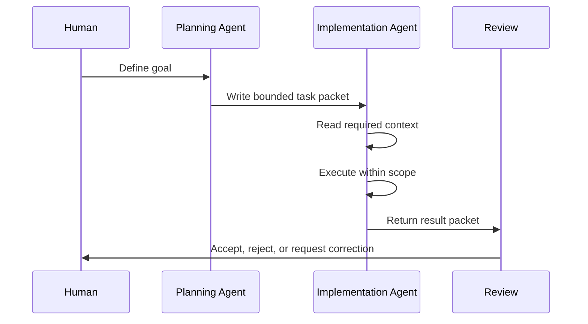

# Agent Relay Loop

Alexandria uses a relay model for multi-agent work.

The goal is not to make agents autonomous. The goal is to make their work bounded, reviewable, and recoverable.

## Roles

| Role | Job |
|---|---|
| Human operator | Sets direction, approves scope, makes final calls |
| Planning agent | Designs the task, defines context, sets stop conditions |
| Implementation agent | Makes bounded edits, runs verification, reports results |
| Review agent | Accepts, rejects, or returns the work for correction |

In the live proof-of-concept, this often maps to Claude planning and reviewing while Codex implements. The pattern is model-agnostic.

## Relay Sequence

## Task Packet Requirements

A relay task should specify:

- mission
- why it matters
- files to read
- files allowed to edit
- files not to modify
- stop conditions
- expected output
- return location
- logging requirement

This prevents hidden assumptions from becoming work.

## Why This Reduces Drift

Drift happens when an agent keeps acting after the goal, scope, or source of truth becomes unclear.

The relay loop reduces drift by forcing:

- a written task boundary before action
- a known return location
- review before integration
- logging after completion
- no guessing when context is missing

## What Counts As a Good Block

A blocked response is not always failure.

If the task is ambiguous, missing context, or outside scope, the correct agent behavior is to stop and say why. That preserves the system better than a confident wrong edit.

## What This Is Not

The relay loop is not:

- an agent swarm
- unattended automation
- a mandatory pipeline for every small task
- a replacement for human approval
- a reason to over-document simple work

Use the relay when coordination risk is real.

