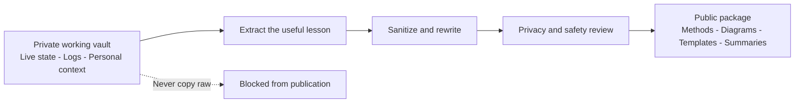

# Public and Private Boundary

Alexandria is designed with a public/private boundary from the beginning.

The public repository is a derived package. It is not a mirror of the live vault.

## Why The Boundary Exists

AI-assisted systems collect sensitive context quickly:

- live state
- personal notes
- local paths
- account-adjacent details
- screenshots
- private project plans
- client or prospect material
- logs and handoffs

If public release is treated as an afterthought, private material will eventually leak.

## Public Layer

The public layer may contain:

- general methodology
- sanitized architecture
- templates
- validation summaries
- principles
- diagrams
- examples using dummy data

## Private Layer

The private layer holds:

- live state
- raw logs
- memory files
- queue items
- personal operating context
- client or business material
- screenshots and account context
- anything uncertain

## Release Rule

Move value, not raw content.

The safe path is:

1. identify the useful lesson
2. remove private details
3. rewrite as public-safe structure
4. review for red flags
5. publish only after approval

## Red Flags

Do not publish content containing:

- API keys, tokens, passwords, credentials
- local machine paths
- email addresses or phone numbers
- screenshots with private tabs or accounts
- private URLs
- raw session logs
- raw agent memory
- client or prospect details
- device or network details

## Practical Standard

A stranger should be able to read the public repo and understand the system without gaining access to the private life of the operator or the live state of the vault.

